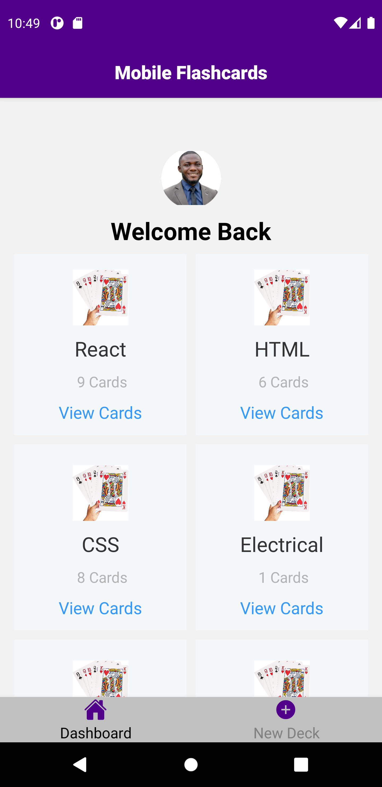
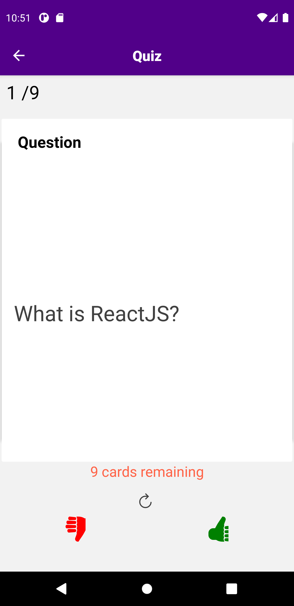
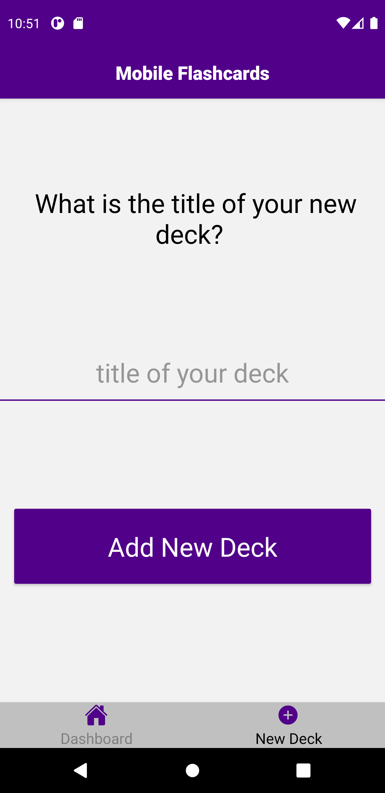
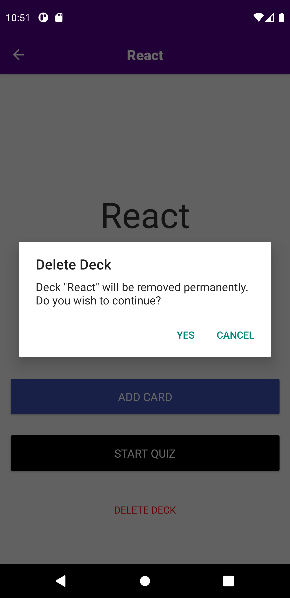

# Mobile Flashcards
React Native Application for mobile fashcards. The application contains decks which also contains cards. Each card is a pair of question and answer. The user can take a quiz on the cards in a particlar deck. Also, the user has the ability to add a card, add a deck and delete a deck. The application has been developed to adapt the styling of both android and ios.

## Getting Started
This application has been developed and tested to run smothly on android simulators as well as Expo Go App on android phones and the web. Kindly follow the instructions below to get started. Enjoy!







## Prerequisites
Before trying out this application, the user must have installed
1. (Node js v14.15.4)[https://nodejs.org/en/]
2. (Java ~v11.0.10)[https://www.oracle.com/java/]
3. (Andoid studio)[https://developer.android.com/studio]
4. (Set up java and andoid environments)[https://developer.android.com/studio/run/emulator]
5. A stable version of gradle preferably 6.8.3. Visit (https://www.oracle.com/java/)[https://www.oracle.com/java/] to download the stable version.

## Installation
- Download the attcahed zip file and extract to your local computer

- Navigate to the root directory of the app and install dependencies using
```
npm install or yarn install
```
- Either add the local.properties file which specifieds the sdk.dir to the android root directory or set the make sure you have set the ANDROID_SDK_ROOT environment variable which points to the installed sdk

- Launch the metro server using
```
npm start
```
**If the metro server fails to start, kindly clear the cache and start it again with**
```
npm start -- --reset-caches
```
- Launch the android emulator and install the app using. If you have problems launching the emulator, launch it sung android studio or genymotion before running the command.
```
npm run android
```

## Platform Tested
The app has been tested on:
1. Android emulators
2. Android Expo Go App
3. Web

## Notifications
Notifications for this app can only be sent when using real android devices and not simulators.

## Author
- Isaac Oppong-Baah